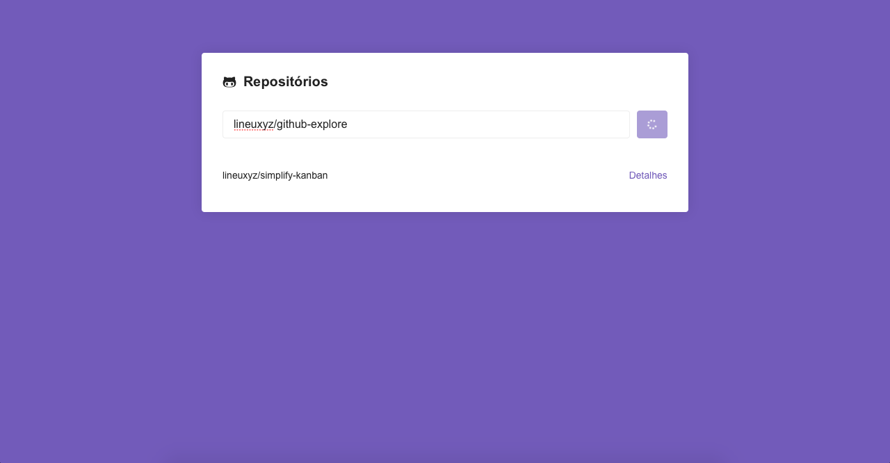
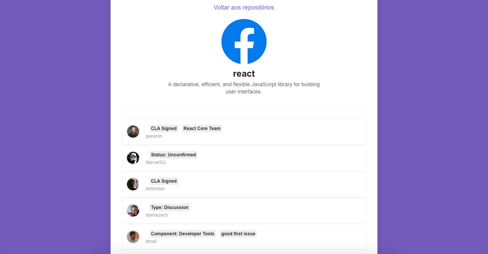

<h1 align="center">
  
</h1>

<h4 align="center">
  Github Issue Loader
</h4>

<p align="center">
  <a href="https://github.com/lineuxyz/github-issue-loader/stargazers"></a>
  
  
  <a href="https://github.com/lineuxyz/github-issue-loader/blob/master/LICENSE"></a>
  <a href="https://www.linkedin.com/in/lineu-pastorelli-5165a7186"></a>
  
  
</p>

<p align="center">
  <a href="#-project">Project</a>&nbsp;&nbsp;&nbsp;|&nbsp;&nbsp;&nbsp;
  <a href="#-technologies">Technologies</a>&nbsp;&nbsp;&nbsp;|&nbsp;&nbsp;&nbsp;
  <a href="#-layout">Layout</a>&nbsp;&nbsp;&nbsp;|&nbsp;&nbsp;&nbsp;
  <a href="#-how-to-use">How to use</a>&nbsp;&nbsp;&nbsp;|&nbsp;&nbsp;&nbsp;
  <a href="#-how-to-contribute">How to contribute</a>&nbsp;&nbsp;&nbsp;|&nbsp;&nbsp;&nbsp;
  <a href="#-license">License</a>
</p>

<h1 align="center">
  
</h1>

## 📚 Project

This project aims to list issues of repositories on Github, just add the author and the repository, and see details you can see the issues and some information from the repository.

## 🖥 Technologies

* [ReactJS](https://reactjs.org)
* [Yarn](https://yarnpkg.com)
* [React-icons](https://react-icons.github.io/react-icons/)
* [Styled-components](https://styled-components.com/docs)
* [Eslint](https://eslint.org)
* [React-router-dom](https://reacttraining.com/react-router/web/guides/quick-start)

## 🔖 Layout

<p align="center">
  
  
  
</p>

## ❓ How to use

To clone an run this application, you'll need [Git](https://git-scm.com), [Yarn](https://yarnpkg.com), [NPM](https://www.npmjs.com/get-npm) installed on your computer.

Execute the command line:

### Clone the project
```bash
# Clone this repository
$ git clone https://github.com/lineuxyz/github-issue-loader

# Go into the repository
$ cd github-issue-loader

# Install dependecies
$ yarn install or npm install

# Run project
$ yarn start or npm start
```

## 🤔 How to contribute

* Make a fork;
* Create a branch with your feature: `git checkout -b my-feature`;
* Commit changes: `git commit -m "feat: my new feature`;
* Make a push to your branch: `git push origin my-feature`

After meging your receipt request to done, you can delete a branch from yours.

## 📜 License

This project is under the MIT license. See the [LICENSE](LICENSE) for details.

Make with ❤️ by [Lineu Pastorelli](https://www.linkedin.com/in/lineu-pastorelli-5165a7186)
